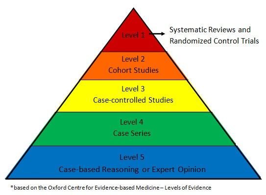

One of my most memorable experiences in medical school was running down a hallway at breakneck pace to save a patient's kidneys. The patient had been wheeled away for a CT scan with contrast just minutes prior and my attending physician caught an error - the patient's kidney function was (slightly) worse than the attending's threshold for delivering contrast. Because contrast is excreted by the kidneys and may be nephrotoxic, there is a concern that those with poor kidney function may be injured further, an entity termed contrast-associated nephropathy1 (see Joel Topf's [Twitter thread](https://twitter.com/kidney_boy/status/1199828796322598912) for a thoughtful summary). I reached the scanner just seconds before the contrast was set to deliver, and helped cancel the scan before harm came to the patient. A study published in JAMA Internal Medicine this year shows that my efforts were likely in vain2.

The gold standard for causal inference in medicine is the randomized control trial. Randomized control trials sit atop the hierarchy of evidence, with observational studies forming the far less illustrious ranks beneath (see image below). For years, observational studies demonstrated an association between contrast and kidney injury. Because randomized control trials were considered either unfeasible or unethical (i.e., if my patient with kidney failure absolutely needs a CT w/ contrast, we will get them one and deal with the consequences later), these observational studies formed the basis of medical decision making. The landmark study by Goulden et al is an observational study that makes a *causal* claim, namely that there is no relationship between contrast and kidney injury. They did so using a technique called regression discontinuity design. How does it work?

Regression discontinuity design is a 'quasi-experimental' technique - that is, it aims to establish causality without random assignment. I was first introduced to this and other quasi-experimental methods via a wonderful primer by Ioana Marinescu, Patrick Lawlor, and Konrad Kording3. As we will see below, the name is crystal clear: by identifying discontinuities in regressions, we can identify causal effects. Regression discontinuity design can be used when a continuous variable is arbitrary thresholded for intervention. 

To determine whether contrast exposure causes kidney injury, Goulden et al took advantage of a fortuitous protocol used in the Alberta hospital system. Patients with a D-dimer level above a cutoff, potentially indicative of a blood clot, were likely to receive a CT pulmonary angiogram (read, CT with contrast), a imaging study to more definitively diagnose blood clots in the vessels of the lungs4. The figure below shows this protocol was carried out appropriately (CTPA: computed tomography pulmonary angiogram).

However, they couldn't just compare the kidney functions of those who received contrast and those who did not, since individuals who received contrast were clearly different from those who didn't. For example, their elevated D-dimer levels may have been due to poor general health, which would contribute to poorer kidney function independent of contrast. The key insight is to recognize that individuals arbitrary close to the threshold from either side are essentially identical, since their exact D-dimer levels will be due to randomness in the blood draw, lab test, and a number of other factors. Regression discontinuity design is therefore to fit the outcome (kidney function) to *two separate* regressions, on one each side of the D-dimer threshold: if there is a discontinuity at the threshold, then there is a causal effect. Goulden and colleagues carried out this exact analysis and, in what should be a fatal blow to contrast-associated nephropathy, failed to find any such discontinuity (or, in the baroque and overburdened language of frequentism, they failed to reject the null - I'm sure I'll write a blog post laying bare my consternations of frequentism at some point). Long-term eGFR below is a measure of kidney function. 

In order for regression discontinuity design to work, subjects and physicians should not be able to control the treatments (for example, subjects somehow elevating their D-dimer levels or physicians deciding to carry out a contrast study despite a low D-dimer). There is some flexibility, as the technique of 'fuzzy' regression discontinuity design can handle some imperfections (in fact, Goulden et al used this technique rather than vanilla regression discontinuity design). 

Those of us in healthcare recognize that medicine is teeming with arbitrarily-chosen thresholds which serve as treatment boundaries. Regression discontinuity design is extremely well-suited for medicine, and ought to mark a new era of evidence-based medicine. It has been used to some extent in medicine, although, as Konrad Kording recently [Tweeted](https://twitter.com/KordingLab/status/1301136756159533056), "data ownership in medicine is \*ugly\*."

Because regression discontinuity design is a general statistical technique, it has seen success in a wide variety of domains. One of my favorites determines the causal relationship between attending an elite university and postgraduate salaries5 (I was originally made aware of this study by this [Tweet](https://twitter.com/JustinSandefur/status/1295416857919459330)). In India, the Senior Secondary School Exam is a standardized test that determines what college students attend. With high scores, they are accepted into public colleges (prestigious) or private colleges (less prestigious). As with our medical example above, we can't just compare the two groups of students, as those with scores above the threshold are quite different from those below the threshold. First, we see that scoring above an arbitrary threshold does result in greater attendance of public colleges.

Interestingly, going to an elite college does not confer a benefit in terms of college exit test scores (to be interpreted as a metric of the quality of education, though the veracity of this claim is tenuous)

More importantly, attending an elite college causes a large increase in salary. As an aside, those who did extremely well on their exams don't enjoy the same benefits (career choice? great school skills but poor real-life skills?)

Another fascinating example studies taxicab economics: what is the causal effect of dollar-based vs percent-based tip suggestion?6. In this study, if the fare was under $15 (the threshold), tip suggestions were $2, $3, or $4. Above this threshold, tip suggestions were 20%, 25%, or 30% of the fare. Below, we observe a discontinuity at the threshold, demonstrating the causal effect of the tip suggestion style (legend: c is the threshold, c* is the optimal threshold, LLR is local linear regression, IK is the Imbens-Kalyanaraman bandwidth used to determine how much data to include in the regression).

Even more fascinating is the implication here. This threshold can be optimized, since observing a causal effect here means money lost for the company. At the optimal threshold (c*), there is no money lost on tips as a result of the tip suggestion style. This brings up a *very* important point - all claims of causality must be interpreted in light of the chosen threshold, which requires bringing domain knowledge to the problem. As a thought experiment, imagine in the study above, the threshold was serendipitously chosen to be ~$11. We would have observed no causal effect, though one could reasonably have argued that an $11 threshold was hiding a true causal effect. In our medical example above, while it is certainly possible that Goulden et al observed no causal effect due to the chosen threshold, unlike the taxi example, it seems difficult to come up with a reasonable explanation why that would be the case.

There are even more creative applications of regression discontinuity design. A recent study argued that individual neurons might employ a form of this technique to estimate their causal effect on behavior7. It remains to be seen whether the predictions of this theory are true, but it is wonderful to see what unbridled creativity towards important problems.

As with any technique, the conclusions are only as good as the assumptions. [This talk](https://youtu.be/fc1hkFC2c1E?t=731) from Andrew Gelman provides a humorous, if horrifying example of when regression discontinuity design goes wrong.

1. Mehran, Roxana, George D. Dangas, and Steven D. Weisbord. "Contrast-associated acute kidney injury." New England Journal of Medicine 380.22 (2019): 2146-2155.
2. Goulden, Robert, et al. "Association of Intravenous Radiocontrast With Kidney Function: A Regression Discontinuity Analysis." JAMA Internal Medicine (2021).
3. Marinescu, Ioana E., Patrick N. Lawlor, and Konrad P. Kording. "Quasi-experimental causality in neuroscience and behavioural research." Nature human behaviour 2.12 (2018): 891-898.
4. American College of Radiology Appropriateness Criteria. Suspected Pulmonary Embolism: Variant 2. <https://acsearch.acr.org/docs/69404/Narrative/>
5. Sekhri, Sheetal. "Prestige matters: Wage premium and value addition in elite colleges." American Economic Journal: Applied Economics 12.3 (2020): 207-25.
6. Marinescu, Ioana Elena, Sofia Triantafillou, and Konrad Kording. "Regression discontinuity threshold optimization." Available at SSRN 3333334 (2019).
7. Lansdell, Benjamin James, and Konrad Paul Kording. "Neural spiking for causal inference." bioRxiv (2019): 253351.