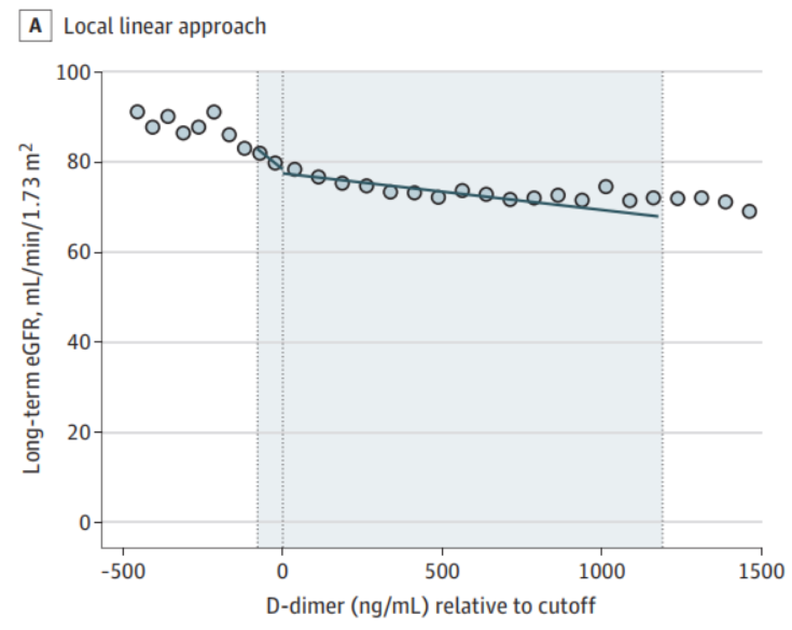
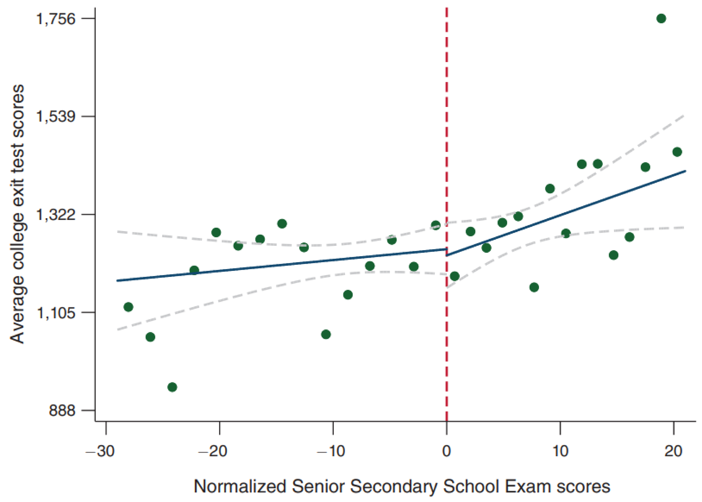

One of my most memorable experiences in medical school was running down a hallway at breakneck pace to save a patient's kidneys. The patient had been wheeled away for a CT scan with contrast just minutes prior and my attending physician caught an error - the patient's kidney function was (slightly) worse than the attending's threshold for delivering contrast. Because contrast is excreted by the kidneys and may be nephrotoxic, there is a concern that those with poor kidney function may be injured further, an entity termed contrast-associated nephropathy1 (see Joel Topf's [Twitter thread](https://twitter.com/kidney_boy/status/1199828796322598912) for a thoughtful summary). I reached the scanner just seconds before the contrast was set to deliver, and helped cancel the scan before harm came to the patient. A study published in JAMA Internal Medicine this year shows that my efforts were likely in vain2.

The gold standard for causal inference in medicine is the randomized control trial. Randomized control trials sit atop the hierarchy of evidence, with observational studies forming the far less illustrious ranks beneath (see image below). For years, observational studies demonstrated an association between contrast and kidney injury. Because randomized control trials were considered either unfeasible or unethical (i.e., if my patient with kidney failure absolutely needs a CT w/ contrast, we will get them one and deal with the consequences later), these observational studies formed the basis of medical decision making. The landmark study by Goulden et al is an observational study that makes a *causal* claim, namely that there is no relationship between contrast and kidney injury. They did so using a technique called regression discontinuity design. How does it work?

Regression discontinuity design is a 'quasi-experimental' technique - that is, it aims to establish causality without random assignment. I was first introduced to this and other quasi-experimental methods via a wonderful primer by Ioana Marinescu, Patrick Lawlor, and Konrad Kording3. As we will see below, the name is crystal clear: by identifying discontinuities in regressions, we can identify causal effects. Regression discontinuity design can be used when a continuous variable is arbitrary thresholded for intervention. 

To determine whether contrast exposure causes kidney injury, Goulden et al took advantage of a fortuitous protocol used in the Alberta hospital system. Patients with a D-dimer level above a cutoff, potentially indicative of a blood clot, were likely to receive a CT pulmonary angiogram (read, CT with contrast), a imaging study to more definitively diagnose blood clots in the vessels of the lungs4. The figure below shows this protocol was carried out appropriately.

However, they couldn't just compare the kidney functions of those who received contrast and those who did not, since individuals who received contrast were clearly different from those who didn't. For example, their elevated D-dimer levels may have been due to poor general health, which would contribute to poorer kidney function independent of contrast. The key insight is to recognize that individuals arbitrary close to the threshold from either side are essentially identical, since their exact D-dimer levels will be due to randomness in the blood draw, lab test, and a number of other factors. Regression discontinuity design is therefore to fit the outcome (kidney function) to *two separate* regressions, on one each side of the D-dimer threshold: if there is a discontinuity at the threshold, then there is a causal effect.

Those of us in healthcare recognize that medicine is teeming with arbitrarily-chosen thresholds which serve as treatment boundaries. 

Sekhri, Sheetal. "Prestige matters: Wage premium and value addition in elite colleges." American Economic Journal: Applied Economics 12.3 (2020): 207-25.

As with any technique, the conclusions are only as good as the assumptions. Domain-specific knowledge

https://youtu.be/fc1hkFC2c1E?t=731

Creative

Lansdell, Benjamin James, and Konrad Paul Kording. "Neural spiking for causal inference." bioRxiv (2019): 253351.

1. Mehran, Roxana, George D. Dangas, and Steven D. Weisbord. "Contrast-associated acute kidney injury." New England Journal of Medicine 380.22 (2019): 2146-2155.
2. Goulden, Robert, et al. "Association of Intravenous Radiocontrast With Kidney Function: A Regression Discontinuity Analysis." JAMA Internal Medicine (2021).
3. Marinescu, Ioana E., Patrick N. Lawlor, and Konrad P. Kording. "Quasi-experimental causality in neuroscience and behavioural research." Nature human behaviour 2.12 (2018): 891-898.
4. American College of Radiology Appropriateness Criteria. Suspected Pulmonary Embolism: Variant 2. <https://acsearch.acr.org/docs/69404/Narrative/>