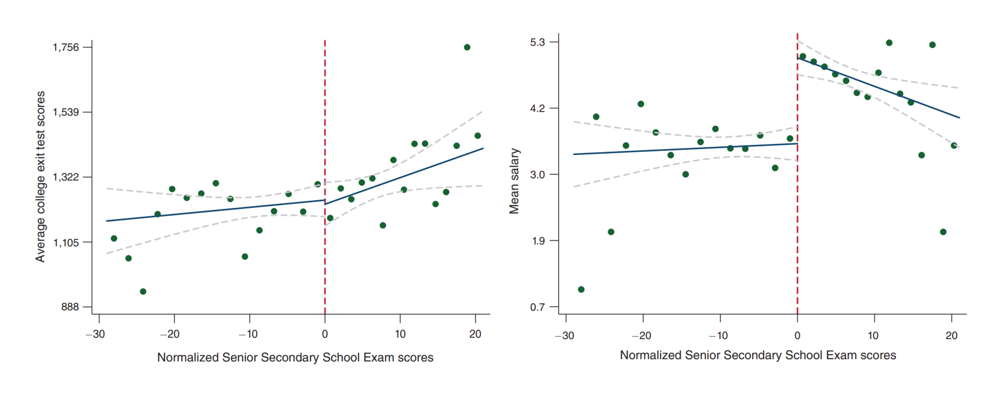

One of my most memorable experiences in medical school was running down a hallway at breakneck pace to save a patient's kidneys. The patient had been wheeled away for a CT scan with contrast just minutes prior and my attending physician caught an error - the patient's kidney function was (slightly) worse than the attending's threshold for delivering contrast. Because contrast is excreted by the kidneys and may be nephrotoxic, there is a concern that those with poor kidney function may be injured further, an entity termed contrast-associated nephropathy1 (see Joel Topf's [Twitter thread](https://twitter.com/kidney_boy/status/1199828796322598912) for a thoughtful summary). I reached the scanner just seconds before the contrast was set to deliver, and helped cancel the scan before harm came to the patient. A study published in JAMA Internal Medicine this year shows that my efforts were likely in vain2.

The gold standard for causal inference in medicine is the randomized control trial. Randomized control trials sit atop the hierarchy of evidence, with observational studies forming the far less illustrious ranks beneath (see image below). For years, observational studies demonstrated an association between contrast and kidney injury. Because randomized control trials were considered either unfeasible or unethical (i.e., if my patient with kidney failure absolutely needs a CT w/ contrast, we will get them one and deal with the consequences later), these observational studies formed the basis of medical decision making. The landmark study by Goulden et al is an observational study that makes a *causal* claim, namely that there is no relationship between contrast and kidney injury. How could they possibly have shown this?

Regression discontinuity design

A wonderful primer by Ioana Marinescu, Patrick Lawlor, and Konrad Kording3.

Sekhri, Sheetal. "Prestige matters: Wage premium and value addition in elite colleges." American Economic Journal: Applied Economics 12.3 (2020): 207-25.

1. Mehran, Roxana, George D. Dangas, and Steven D. Weisbord. "Contrast-associated acute kidney injury." New England Journal of Medicine 380.22 (2019): 2146-2155.
2. Goulden, Robert, et al. "Association of Intravenous Radiocontrast With Kidney Function: A Regression Discontinuity Analysis." JAMA Internal Medicine (2021).
3. Marinescu, Ioana E., Patrick N. Lawlor, and Konrad P. Kording. "Quasi-experimental causality in neuroscience and behavioural research." Nature human behaviour 2.12 (2018): 891-898.